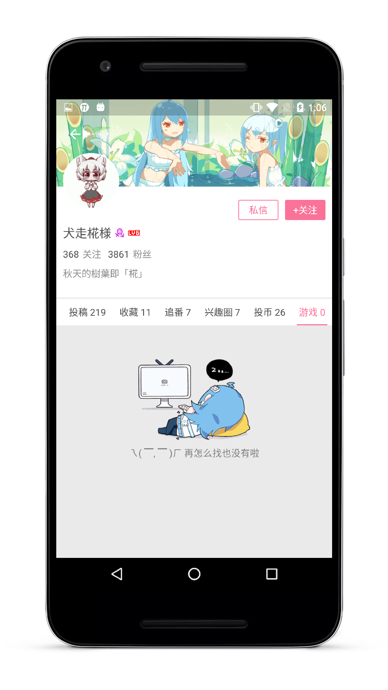

# Imitation Bilibili Android Client

    

## Introduce

### Function has been completed

* 1.首页六大模块，推荐，番剧，直播，关注，分区，发现的实现。

* 2.视频详情界面，视频评论，使用ijkplayer完成的视频播放，烈焰弹幕库实现的弹幕功能。

* 3.番剧模块的实现,包括专题详情界面，番剧详情界面,番剧放送表，番剧索引,新番连载,分季新番。

* 4.使用ijkplayer实现的直播视频的播放。(直播的弹幕没有实现，暂时还抓不到弹幕的数据)

* 5.游戏中心，话题中心,活动中心,原创排行榜,全区排行榜,离线缓存的实现。

* 6.全区搜索的实现，目前支持综合视频，番剧，话题的搜索。

* 7.直播详情界面的实现,还在完善中。

* 8.仿B站登录的小彩蛋。(登录只是假登录，随意输入帐号密码即可)

* 9.用户详情界面的实现。

* 10.其他的一些仿官方的界面实现细节等。

## The Api documentation

* BiliBili API / REST service written in Go
[WhiteBlue](https://github.com/WhiteBlue)/**[bilibili-go](https://github.com/WhiteBlue/bilibili-go)**

* bilibili官方文档搬运(官方文档已不对外开放)
[fython](https://github.com/fython)/**[BilibiliAPIDocs](https://github.com/fython/BilibiliAPIDocs)**

## AppKey

 * 已公开了一个公用的Appkey，目前只有分区界面才使用到，不过请尽量不要使用Appkey去做大量的请求操作，会导致Appkey被封掉，请悉知。

## Instructions

>由于该项目是业余时间开发，更新比较慢还请见谅，有任何意见，bug，问题可以提issuse，我会第一时间关注并解决.

 * 项目默认minSdkVersion设置的为21,因为21以下可能有些界面需要做适配,由于时间有限,只能后期慢慢完善,这个可以自己按照需求修改。

 * Apk暂时不提供下载,因为还有一些界面功能没有做完,等全部完善后会上传到fir.im。

 * 后期会抽时间使用MVP来重构该项目,让整体架构更清晰。

## The statement

如果该项目有侵犯B站版权问题，或被告知需停止共享与使用，本人会及时删除此页面与整个项目。

## Update log

>由于每个版本更新的东西较多，所以从现在开始每个版本都会贴上更新日志.

### V2.2.2

  * 1.添加全新的用户详情界面，跟官方保持一致。
  * 2.添加追番界面。
  * 3.修复主页推荐的显示Bug，一些未知的数据处理。
  * 4.修复部分已知Bug。

### V2.2.1

  * 1.修改了番剧时间表的界面细节以及业务逻辑,去掉了比较旧的番剧请求接口。
  * 2.视频详情界面的相关视频列表修改,去掉了up主推荐视频界面。
  * 3.视频详情界面的视频评论界面修改,增加热门评论。
  * 4.修复部分已知Bug。

### V2.2

  * 1.增加了番剧详情界面的实现。
  * 2.增加了话题中心,活动中心,热搜词tag的实现。
  * 3.去掉了比较旧的Api接口,更新了新的全区排行榜,原创排行榜的实现。
  * 4.修复了主页推荐界面的显示Bug。
  * 5.暂时屏蔽了分区,新番放送表,追番等,下一个版本会更新。

### V2.1.7

  * 1.主页推荐界面,番剧界面的大部分修改,保持跟官方版本一致。
  * 2.增加了原创排行榜,新番连载,分季新番等新界面。
  * 3.修改了全局ToolBar的Textsize,修复了之前字体过大的问题。
  * 4.主界面整体结构修改,修复切换显示bug和加载错误的问题。
  * 5.修复了很多已知的Bug。

### V2.1.6

  * 1.增加了夜间模式切换
  * 2.界面细节调整
  * 3.增加主题切换，因时间关系，坑还未填完

### V2.1.5

  * 1.增加全区排行榜界面
  * 2.游戏中心数据界面更新

### V2.1.4

  * 1.使用ijkplayer替换掉Vitamio
  * 2.完成视频播放界面
  * 3.删除无用的资源文件
  * 4.屏幕适配工作

### V2.1.3

  * 1.主页推荐界面优化
  * 2.增加主页界面错误处理
  * 3.增加直播送礼物特效动画

## Screenshots

 

 

 

 

 

 

 

 

 

 

 

 

 

 

 

 

 

 

 

### Thanks to the open source project

* [RxJava](https://github.com/ReactiveX/RxJava)
* [RxAndroid](https://github.com/ReactiveX/RxAndroid)
* [RxBinding](https://github.com/JakeWharton/RxBinding)
* [RxLifecycle](https://github.com/trello/RxLifecycle)
* [okhttp](https://github.com/square/okhttp)
* [retrofit](https://github.com/square/retrofit)
* [ijkplayer](https://github.com/Bilibili/ijkplayer)
* [DanmakuFlameMaster](https://github.com/Bilibili/DanmakuFlameMaster)
* [butterknife](https://github.com/JakeWharton/butterknife)
* [glide](https://github.com/bumptech/glide)
* [MaterialSearchView](https://github.com/MiguelCatalan/MaterialSearchView)
* [FlycoTabLayout](https://github.com/H07000223/FlycoTabLayout)
* [MagicaSakura](https://github.com/Bilibili/MagicaSakura)
* [FlowLayout](https://github.com/hongyangAndroid/FlowLayout)

## About me

An android developer in Wuhan.

If you want to make friends with me, You can focus on my weibo.

## License

 Copyright 2016 HotBitmapGG

 Licensed under the Apache License, Version 2.0 (the "License"); you may not use this file except in compliance with the License. You may obtain a copy of the License at

 http://www.apache.org/licenses/LICENSE-2.0

 Unless required by applicable law or agreed to in writing, software distributed under the License is distributed on an "AS IS" BASIS, WITHOUT WARRANTIES OR CONDITIONS OF ANY KIND, either express or implied. See the License for the specific language governing permissions and limitations under the License.

