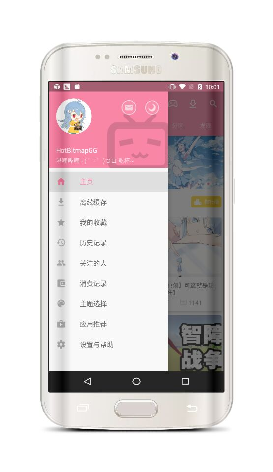
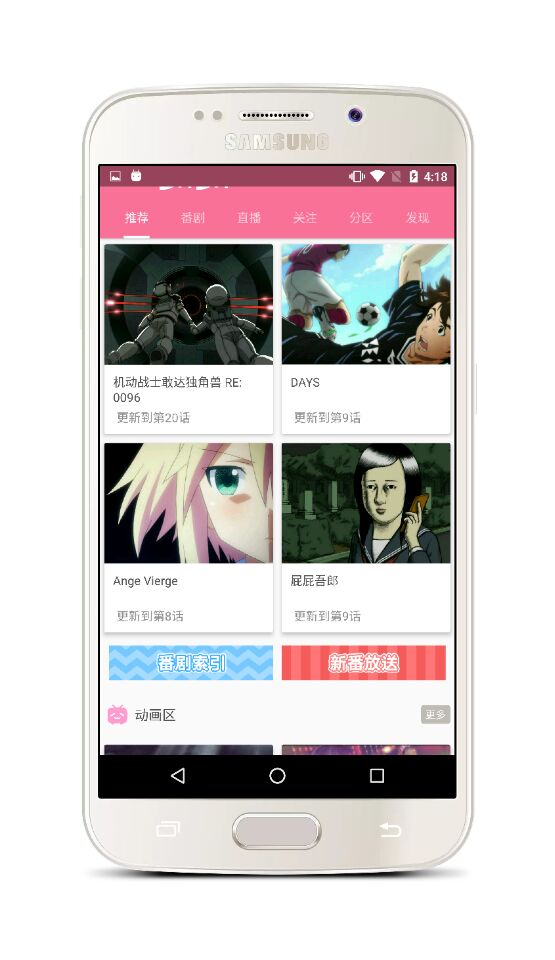
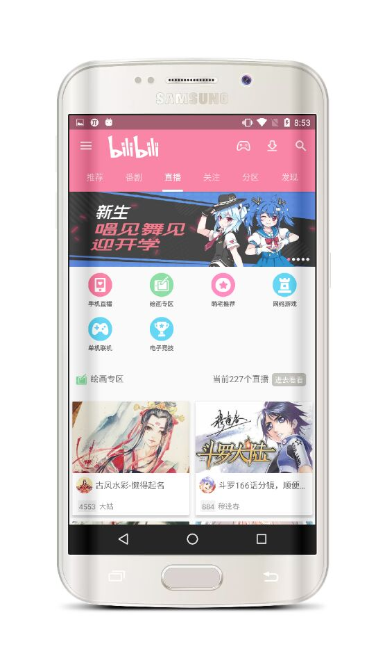
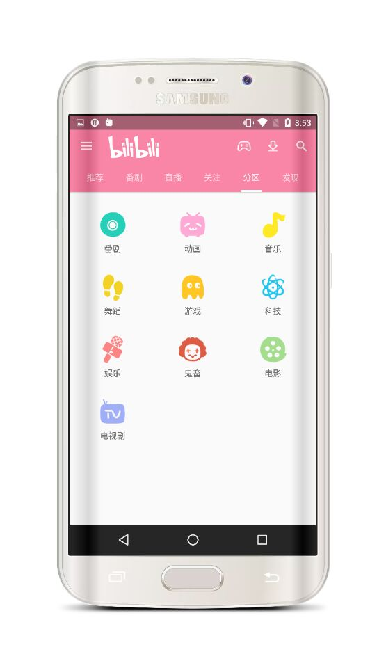
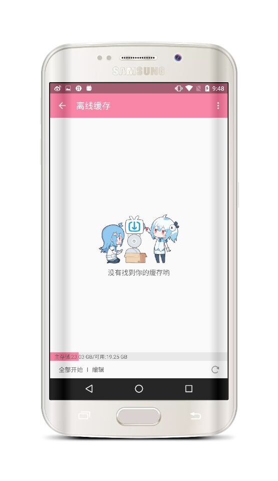
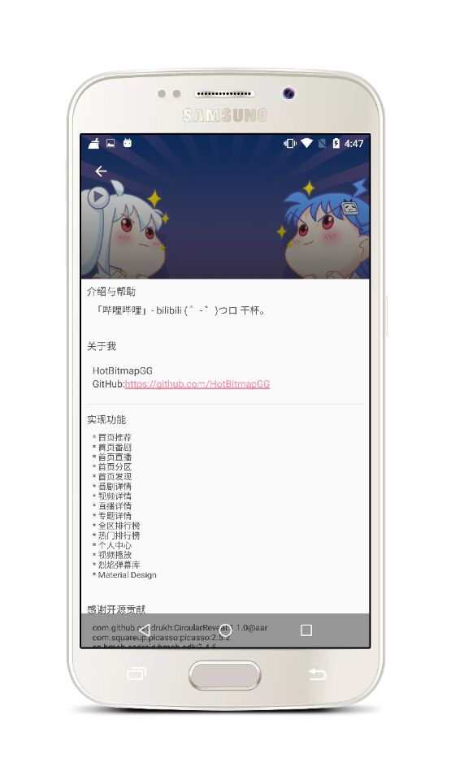
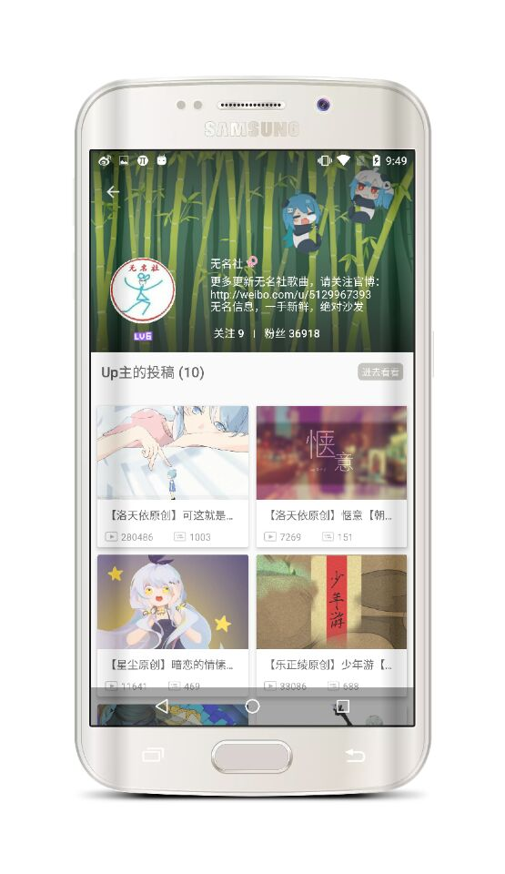
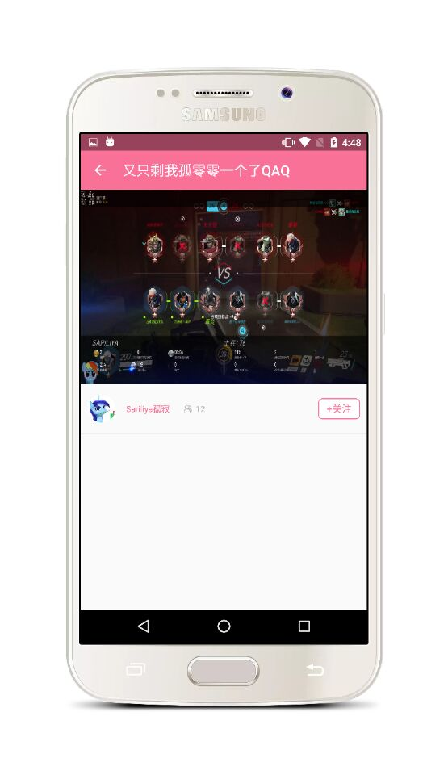
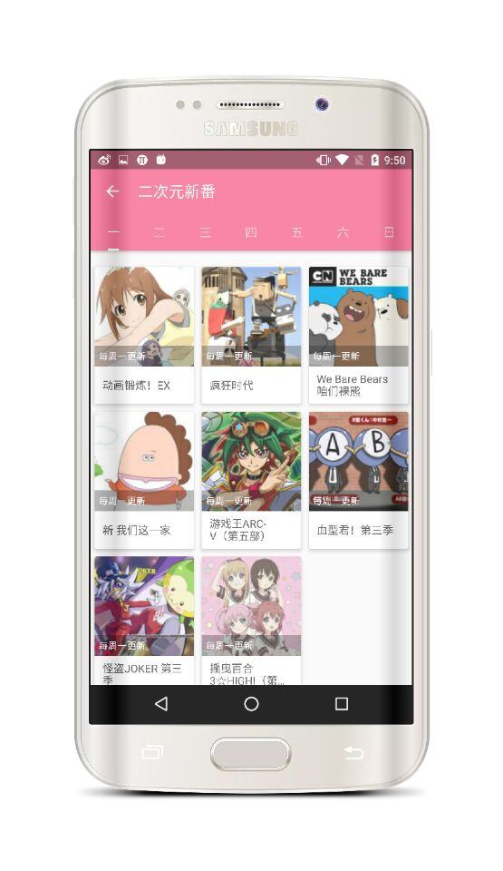
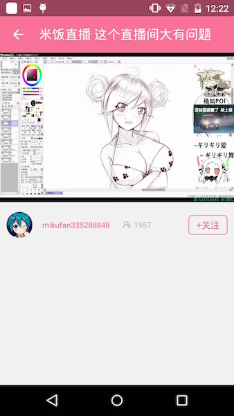

## Tips

  * 该项目正在持续开发中.

## v2.0新版Apk

## 截图

 

 

 

 

 

 

 

 

 

 

## Other

  * 知了日报客户端: https://github.com/HotBitmapGG/RxZhiHu

  * 高仿BiliBili客户端: https://github.com/HotBitmapGG/OhMyBiliBili

  * Gank.IO客户端: https://github.com/HotBitmapGG/StudyProject

  * 妹子福利App: https://github.com/HotBitmapGG/MoeQuest

  * 圆环进度条:https://github.com/HotBitmapGG/RingProgressBar

  * 安卓学习代码练习:https://github.com/HotBitmapGG/AndroidEveryDayPractice
  
  * 轻量级的RecycleViewAdapter辅助类库 :https://github.com/HotBitmapGG/EasyRecycleAdapterHelper

## License

 Copyright 2016 HotBitmapGG

 Licensed under the Apache License, Version 2.0 (the "License"); you may not use this file except in compliance with the License. You may obtain a copy of the License at

 http://www.apache.org/licenses/LICENSE-2.0

 Unless required by applicable law or agreed to in writing, software distributed under the License is distributed on an "AS IS" BASIS, WITHOUT WARRANTIES OR CONDITIONS OF ANY KIND, either express or implied. See the License for the specific language governing permissions and limitations under the License.

