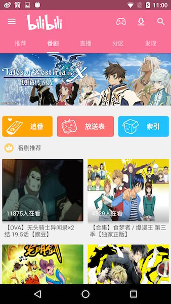
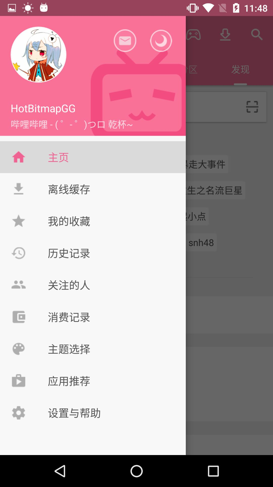
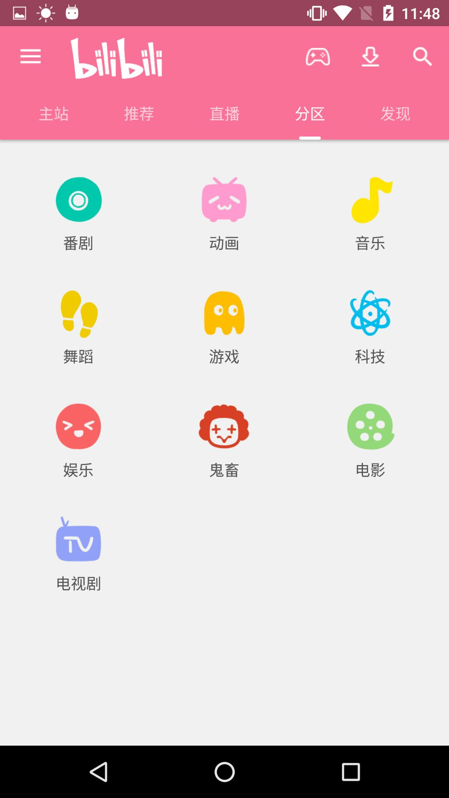
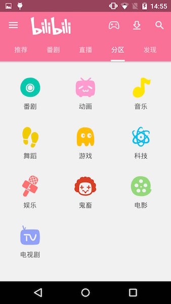
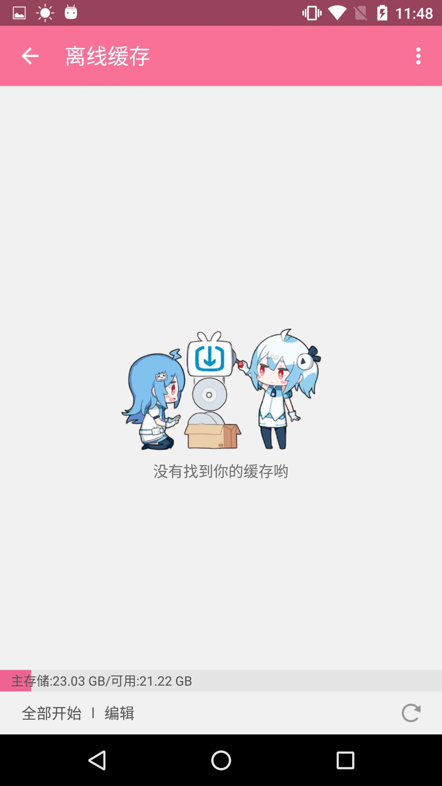
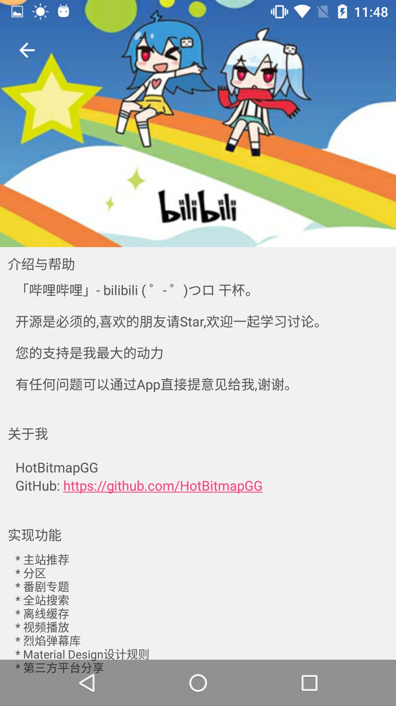

# OhMyBiliBili

## Tips

 * 目前项目还在进行大修改,主界面模块大多已完成,调用接口大部分已更换,现在播放视频可以不要AppKey了.
 * 由于Vitamio编译的so库暂时只支持在6.0以下的手机上进行播放视频.
 * 首页数据跟官方同步,番剧详情界面暂时没有做,后期会加上.

## v2.0新版Apk

## 截图

 

 

 

 

 

 

 

 

 

 

## Other

  * 知了日报客户端: https://github.com/HotBitmapGG/RxZhiHu

  * 高仿BiliBili客户端: https://github.com/HotBitmapGG/OhMyBiliBili

  * Gank.IO客户端: https://github.com/HotBitmapGG/StudyProject

  * 妹子福利App: https://github.com/HotBitmapGG/MoeQuest

  * 圆环进度条:https://github.com/HotBitmapGG/RingProgressBar

  * 安卓学习代码练习:https://github.com/HotBitmapGG/AndroidEveryDayPractice
  
  * 轻量级的RecycleViewAdapter辅助类库 :https://github.com/HotBitmapGG/EasyRecycleAdapterHelper

## License

 Copyright 2016 HotBitmapGG

 Licensed under the Apache License, Version 2.0 (the "License"); you may not use this file except in compliance with the License. You may obtain a copy of the License at

 http://www.apache.org/licenses/LICENSE-2.0

 Unless required by applicable law or agreed to in writing, software distributed under the License is distributed on an "AS IS" BASIS, WITHOUT WARRANTIES OR CONDITIONS OF ANY KIND, either express or implied. See the License for the specific language governing permissions and limitations under the License.

